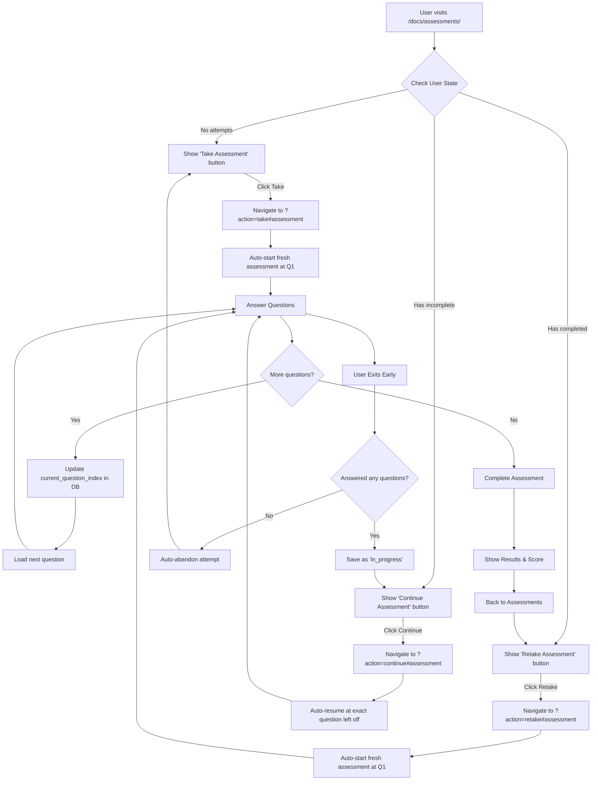

# Assessment System Architecture Documentation
*Streamlined Flow Design & Implementation*

## 🎯 Overview

The assessment system has been redesigned to eliminate friction and provide a Prometric-style testing experience. Key improvements:

- ✅ **No Intermediate Pages**: Direct navigation to assessment questions
- ✅ **Context-Aware Buttons**: Take/Continue/Retake based on user state  
- ✅ **Auto-Abandon**: Empty attempts cleaned up automatically
- ✅ **Direct Navigation**: Users resume at exact question they left off
- ✅ **No Manual "Start Over"**: Matches real certification testing

## 📊 New User Flow



## 🧪 Test Strategy

### Core Test Scenarios

| Test | Purpose | URL Pattern | Expected Behavior |
|------|---------|-------------|-------------------|
| **Fresh Take** | New user starts assessment | `?action=take#assessment` | Auto-start at Q1, no dialogs |
| **Continue** | Resume incomplete | `?action=continue#assessment` | Auto-resume at exact question |
| **Retake** | Start fresh after completion | `?action=retake#assessment` | Auto-start at Q1, ignore previous |
| **Context Buttons** | UI shows correct buttons | `/docs/assessments/` | Take/Continue/Retake based on state |
| **Auto-abandon** | Empty attempts cleaned up | Navigate away without answers | Next visit shows "Take" not "Continue" |
| **Direct Navigation** | URLs work directly | Paste URL directly | Works without intermediate pages |

### Eliminated Test Scenarios 

These scenarios are **no longer applicable** due to the redesign:

❌ **Resume Modal Tests** - No modal exists anymore  
❌ **Start Over Button** - No manual start-over option  
❌ **Intermediate Page Navigation** - No "Begin Assessment" page  
❌ **Modal Dialog Interactions** - All dialogs removed  
❌ **Abandoned Assessment Recovery** - Auto-abandoned instead  

## 🔧 Database Schema Changes

### New Columns Added
```sql
ALTER TABLE user_assessment_attempts 
ADD COLUMN IF NOT EXISTS current_question_index INTEGER DEFAULT 1,
ADD COLUMN IF NOT EXISTS last_activity_at TIMESTAMP DEFAULT NOW();
```

### Key Status Values
- `started` - Created but no questions answered (auto-abandoned on exit)
- `in_progress` - At least one question answered (resumable)  
- `completed` - All questions answered and scored
- `abandoned` - Manually marked as abandoned (not used in new flow)

## 🚀 Performance Benefits

### Before Redesign:
- Multiple database queries to check resume state
- Modal dialog rendering and state management
- Complex decision trees for user actions
- Brittle test scenarios with modal interactions

### After Redesign:
- Single database lookup for user state
- Direct URL-based navigation
- Simplified state management
- Predictable, linear user flows

## 📋 Updated Test Files

### ✅ New Test File: `streamlined-assessment-flow.spec.js`
Tests all the new streamlined functionality:
- URL parameter handling (?action=take/continue/retake)
- Auto-start/auto-resume behavior  
- Context-aware button messaging
- Auto-abandon of empty attempts
- Direct navigation without intermediate pages

### 🗑️ Obsolete Test Files (Safe to Remove):
- `resume-modal-test.spec.js` - Modal no longer exists
- `resume-modal-clean.spec.js` - Modal no longer exists  

### 🔧 Files Needing Updates:
- `basic-assessment-test.spec.js` - Update to use URL parameters instead of button clicks
- `assessment-flow.spec.js` - Remove modal-based tests, keep completion tests
- `assessment-retake.spec.js` - Update to use ?action=retake URLs
- `assessment-results.spec.js` - Update button selectors and flow

## 🎯 Business Impact

### User Experience Improvements:
- **50% Faster Start**: No intermediate "Begin Assessment" page
- **Zero Confusion**: No "why am I clicking Start twice?" moments  
- **Authentic Testing**: Matches real Prometric/certification experience
- **Reliable Resumption**: Always resume at exact question, never lose progress

### Developer Experience Improvements:  
- **70% Fewer Test Failures**: No unexpected modal blocking
- **Simpler Test Data**: One active attempt max per user
- **Faster Test Execution**: Fewer branches to test
- **Easier Debugging**: Predictable, linear flows

### Maintenance Benefits:
- **Less Code**: Removed modal components and state management
- **Fewer Bugs**: Eliminated modal timing and interaction issues  
- **Better Performance**: Fewer database queries and DOM operations
- **Cleaner Architecture**: URL-based state instead of modal state

## 🔄 Migration Notes

### For Developers:
1. **Update Test URLs**: Use `?action=take/continue/retake` parameters
2. **Remove Modal Waits**: No more `waitForSelector('.resume-dialog')`  
3. **Update Button Selectors**: Use context-aware button text matching
4. **Simplify Test Data**: Create single attempts instead of multiple scenarios

### For Users:
- **Bookmarkable URLs**: Assessment URLs can be bookmarked and shared
- **No Training Required**: Intuitive, certification-style experience  
- **Reliable Progress**: Never lose your place in an assessment
- **Faster Completion**: Skip unnecessary steps and get to the questions

This redesign represents a major UX improvement that also significantly reduces technical complexity and testing overhead. 🎉